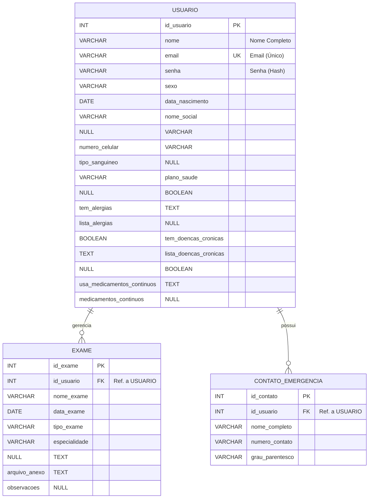

# Diagrama de Entidade-Relacionamento

```mermaid
erDiagram
    USUARIO {
        INT id_usuario PK
        VARCHAR nome "Nome Completo"
        VARCHAR email UK "Email (Único)"
        VARCHAR senha "Senha (Hash)"
        VARCHAR sexo
        DATE data_nascimento
        VARCHAR nome_social NULL
        VARCHAR numero_celular
        VARCHAR tipo_sanguineo NULL
        VARCHAR plano_saude NULL
        BOOLEAN tem_alergias
        TEXT lista_alergias NULL
        BOOLEAN tem_doencas_cronicas
        TEXT lista_doencas_cronicas NULL
        BOOLEAN usa_medicamentos_continuos
        TEXT medicamentos_continuos NULL
    }

    EXAME {
        INT id_exame PK
        INT id_usuario FK "Ref. a USUARIO"
        VARCHAR nome_exame
        DATE data_exame
        VARCHAR tipo_exame
        VARCHAR especialidade NULL
        TEXT arquivo_anexo
        TEXT observacoes NULL
    }

    CONTATO_EMERGENCIA {
        INT id_contato PK
        INT id_usuario FK "Ref. a USUARIO"
        VARCHAR nome_completo
        VARCHAR numero_contato
        VARCHAR grau_parentesco
    }

    USUARIO ||--o{ EXAME : gerencia
    USUARIO ||--o{ CONTATO_EMERGENCIA : possui

```
